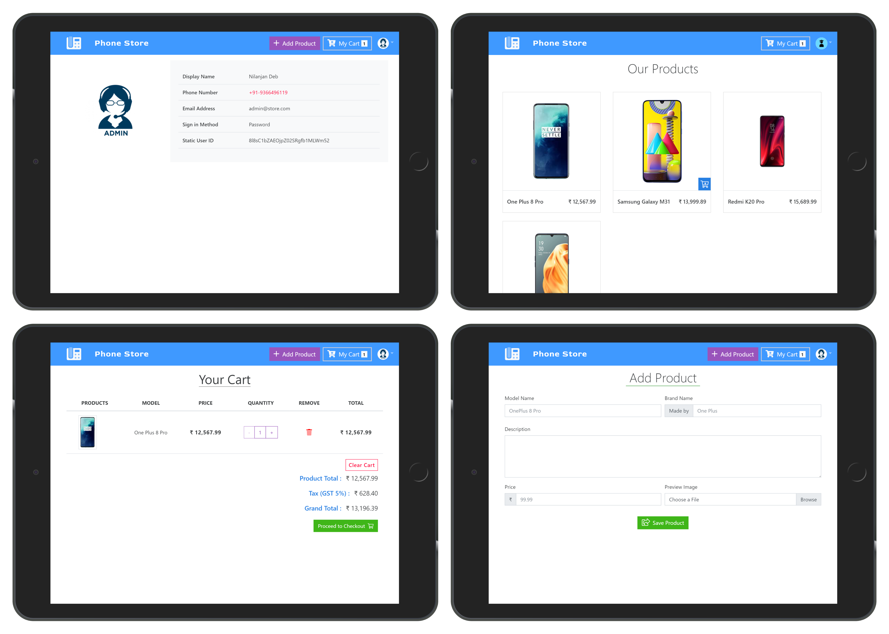

## Food Ordering Web App using Vue JS

Simple food ordering website Using VueJS, firebase, NodeJS and MongoDB.

- #### Live Demo [here](https://food-order-app-nil.herokuapp.com/).
  - Test User Credentials
    - Email: `user@gmail.co`
    - Password: `123456`
  - Test Admin Credentials
    - Email: `admin@foodsite.com`
    - Password: `123456`
  - Test PayPal Credentials
    - Email: `nil.personal.dev@gmail.com`
    - Password: `123456789`
- #### Github Repository [link](https://github.com/nil1729/food-order-app).

---

### Technology and Modules used for this Project

1. `Node JS Express Framework` is used as a building Backend part of this Website.
2. `MongoDB` is used to Store Products Details and URL of Photos.
3. `Firebase Storage` is used for store the Uploaded Files.
4. `Firebase Authentication` is used for for Authenticate a User. User can authenticate using **Google Sign in** or **Custom Email Password** Method.
5. `Vue JS` is used as frontend Framework for building SPA.
6. `Bootstrap` is used for building UI and this website is Responsive for Desktop Devices and Tabs only.
7. Site has `Admin` functionality by which site owner can add Product to his Store.
8. Site is responsive for Desktop Devices and Tabs. (I am working on for responsiveness on small Devices)

---

## Run this Project on Local Environment

1. **Prerequisites**

   - NodeJS installed on your Local machine
   - MongoDB installed on your local machine or have an Atlas Account.
   - A Gmail Account for Firebase Services.
   - A PayPal Account and a Sandbox account for testing purposes.

2. **Credentials Setup**

   - Create a `MongoDB Atlas` Account for Host this Project Online. Find Tutorials [here](https://www.youtube.com/watch?v=KKyag6t98g8).
   - Setup a `Firebase Project` for using `Firestore and Authentication`. Find Tutorials [here](https://www.youtube.com/watch?v=6juww5Lmvgo).
   - Setup [Firestore](https://www.youtube.com/watch?v=UFLvSp4Mh9k&list=PL4cUxeGkcC9itfjle0ji1xOZ2cjRGY_WB&index=2) and [Enable Authenitaion Methods](https://www.youtube.com/watch?v=-OKrloDzGpU)
   - Generate `Private keys for Firebase Admin`. Find tutorials [here](https://youtu.be/WtYzHTXHBp0).
   - Create a `PayPal account` and `Sandbox account`. Find Tutorials [here](https://www.youtube.com/watch?v=AtZGoueL4Vs&t=293s)

3. **Project Setup**

   - Clone this Repository or Download the zip File.
     ```
      >> git clone https://github.com/nil1729/phone-order-app.git
     ```
   - Create a new file named `secret.json` on `config` directory which contains Generated Private keys on Firebase project.

     ```
         {
             "type": "service_account",
             "project_id": "",
             "private_key_id": "",
             "private_key": "",
             "client_email": "",
             "client_id": "",
             "auth_uri": "",
             "token_uri": "",
             "auth_provider_x509_cert_url": "",
             "client_x509_cert_url": ""
         }

     ```

   - Create another `cofig.js` file on `/client/src/firebase`. Put all firebase config Credentials for Frontend. (In following Format)

     ```
       const firebaseConfig = {
           apiKey: "",
           authDomain: "",
           databaseURL: "",
           projectId: "",
           storageBucket: "",
           messagingSenderId: "",
           appId: "",
           measurementId: ""
       };

       export default firebaseConfig;
     ```

   - Create a `.env` file on root directory. Which Contains all necessary Secret Credentials (for backend only) for this site.
     ```
      DB_URI = <- Mongo Atlas URI ->
      PAYPAL_CLIENT_ID = <- PayPal Sandbox Client ID (Also use your own client ID on Frontend) ->
      PAYPAL_CLIENT_SECRET = <- PayPal Sandbox Client Secret (Only for backend server to verify purchase) ->
     ```
   - Run this command

     ```
      >> npm run dev  // to start Vue Development server and Backend server together.

      >> npm run server // to start only Backend server

      >> npm run Client // to start Vue Development server only (But it will not working alone as api depends on Backend also)

     ```

4. **Admin Setup**
   - Run this Command on root directory
     ```
       >> npm run admin
     ```

<!-- --- -->

<!-- ### Website Preview

##  -->

---

<p style="text-align: center;">Made With<span style="color: red;"> &#10084; </span>by <a href="https://github.com/nil1729" target="_blank"> Nilanjan Deb </a> </p>
